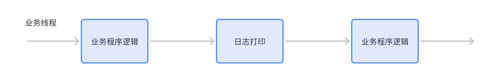
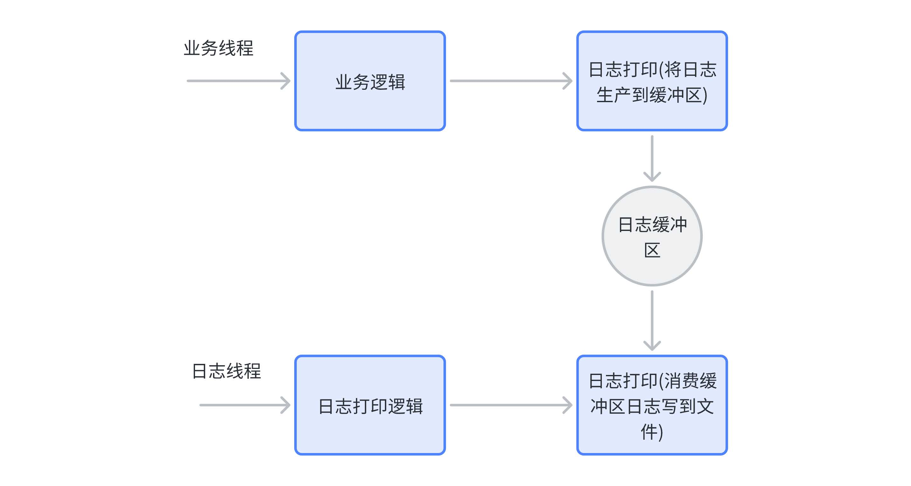
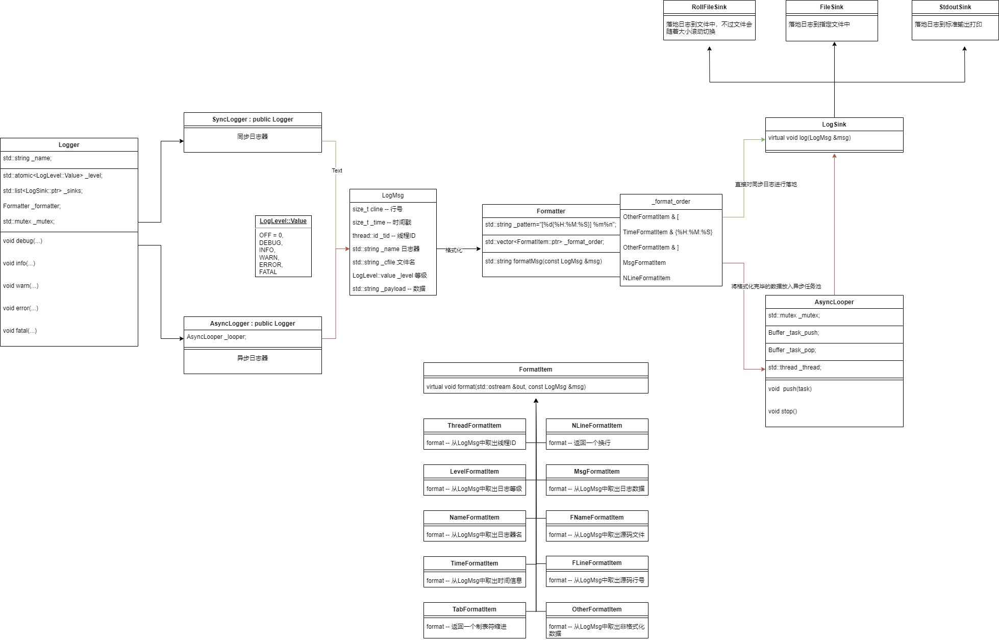
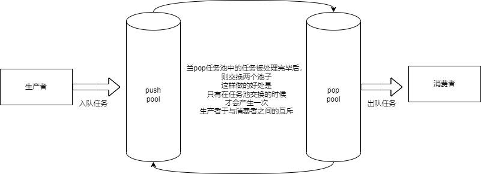

日志落地(LogSink)类设计（简单工厂模式）

日志落地(LogSink)类设计（简单工厂模式）# Log_System

基于多设计模式下的同步&amp;异步日志系统

## 1. 项目介绍

本项目主要实现一个日志系统， 其主要支持以下功能：

- 支持多级别日志消息
- 支持同步日志和异步日志
- 支持可靠写入日志到控制台、文件以及滚动文件中
- 支持多线程程序并发写日志
- 支持扩展不同的日志落地目标地

## 2. 开发环境

* CentOS 7
* vscode/vim
* g++/gdb
* Makefile

## 3. 核心技术

* 类层次设计(继承和多态的应用)
* C++11(多线程、auto、智能指针、右值引用等)
* 双缓冲区
* 生产消费模型
* 多线程
* 设计模式(单例、工厂、代理、模板等)

## 4. 日志系统介绍

### 4.1 为什么需要日志系统

1. 生产环境的产品为了保证其稳定性及安全性是不允许开发人员附加调试器去排查问题， 可以借助日志系统来打印一些日志帮助开发人员解决问题
   上线客户端的产品出现bug无法复现并解决， 可以借助日志系统打印日志并上传到服务端帮助开发人员进行分析
2. 对于一些高频操作（如定时器、心跳包）在少量调试次数下可能无法触发我们想要的行为，通过断点的暂停方式，我们不得不重复操作几十次、上百次甚至更多，导致排查问题效率是非常低下， 可以借助打印日志的方式查问题
3. 在分布式、多线程/多进程代码中， 出现bug比较难以定位， 可以借助日志系统打印log帮助定位bug
4. 帮助首次接触项目代码的新开发人员理解代码的运行流程

### 4.2 日志系统技术实现

日志系统的技术实现主要包括三种类型:

1. 利用printf、std::cout等输出函数将日志信息打印到控制台
2. 对于大型商业化项目， 为了方便排查问题，我们一般会将日志输出到文件或者是数据库系统方便查
3. 询和分析日志， 主要分为同步日志和异步日志方式

#### 4.2.1 同步写日志

同步日志是指当输出日志时，必须等待日志输出语句执行完毕后，才能执行后面的业务逻辑语句，日志输出语句与程序的业务逻辑语句将在同一个线程运行。每次调用一次打印日志API就对应一次系统调用write写日志文件。

在高并发场景下，随着日志数量不断增加，同步日志系统容易产生系统瓶颈：

* 一方面，大量的日志打印陷入等量的write系统调用，有一定系统开销。
* 另一方面，使得打印日志的进程附带了大量同步的磁盘IO，影响程序性能。

#### 4.2.2 异步写日志

异步日志是指在进行日志输出时，日志输出语句与业务逻辑语句并不是在同一个线程中运行，而是有专门的线程用于进行日志输出操作。业务线程只需要将日志放到一个内存缓冲区中不用等待即可继续执行后续业务逻辑（作为日志的生产者），而日志的落地操作交给单独的日志线程去完成（作为日志
的消费者）, 这是一个典型的生产-消费模型。

这样做的好处是即使日志没有真的地完成输出也不会影响程序的主业务，可以提高程序的性能：

* 主线程调用日志打印接口成为非阻塞操作
* 同步的磁盘IO从主线程中剥离出来交给单独的线程完成

## 5. 日志系统框架设计

将一条消息，进行格式化成为指定格式的字符串后，写入到指定位置

本项目实现的是一个多日志器日志系统，主要实现的功能是让程序员能够轻松的将程序运行日志信息落地到指定的位置，且支持同步与异步两种方式的日志落地方式。

### 5.1 模块划分

* 日志等级模块：对输出日志的等级进行划分，以便于控制日志的输出，并提供等级枚举转字符串功能。
* 日志消息模块：中间存储日志输出所需的各项要素信息
* 日志消息格式化模块：设置日志输出格式，并提供对日志消息进行格式化功能。
* 日志消息落地模块：决定了日志的落地方向，可以是标准输出，也可以是日志文件，也可以滚动文件输出....
* 日志器模块：此模块是对以上几个模块的整合模块，用户通过日志器进行日志的输出，有效降低用户的使用难度。包含有：日志消息落地模块对象，日志消息格式化模块对象，日志输出等级
* 日志器管理模块：创建的所有日志器进行统一管理。并提供一个默认日志器提供标准输出的日志输出。
* 异步线程模块：实现对日志的异步输出功能，用户只需要将输出日志任务放入任务池，异步线程负责日志的落地输出功能，以此提供更加高效的非阻塞日志输出。

### 5.2 模块关系图

## 6. 代码设计

### 6.1 实用类设计

提前完成一些零碎的功能接口，以便于项目中会用到。

* 获取系统时间
* 判断文件是否存在
* 获取文件的所在目录路径
* 创建目录

### 6.2 日志等级类设计

定义出日志系统所包含的所有日志等级，分别为：

1. UNKNOW：未知等级日志
2. DEBUG：调试等级的日志
3. INFO：提示等级的日志
4. WARN：警告等级的日志
5. ERROR：错误等级的日志
6. FATAL：致命错误等级的日志
7. OFF：关闭所有日志输出

每个项目都会设置一个默认的日志输出等级，只有输出的日志等级大于等于默认限制等级的时候才可以进行输出

提供一个接口，将对应等级的枚举，转换为一个对应的字符串，例如DEBUG -->> "DEBUG"

### 6.3 日志消息类设计

日志消息类主要是封装一条完整的日志消息所需的内容，其中包括日志输出时间、日志等级、日志源文件名称、源代码行号、线程ID、具体的日志信息等内容。

### 6.4 日志输出格式化类设计

日志格式化（Formatter）类主要负责格式化日志消息，组织成为指定格式的字符串。其主要包含以下内容：

1. 格式化字符串
   %d 日期
   %T 缩进
   %t 线程id
   %p 日志级别
   %c 日志器名称
   %f 文件名
   %l 行号
   %m 日志消息
   %n 换行
2. 格式化子项数组

   MsgFormatItem ：表示要从LogMsg中取出有效日志数据
   LevelFormatItem ：表示要从LogMsg中取出日志等级
   NameFormatItem ：表示要从LogMsg中取出日志器名称
   ThreadFormatItem ：表示要从LogMsg中取出线程ID
   TimeFormatItem ：表示要从LogMsg中取出时间戳并按照指定格式进行格式化
   CFileFormatItem ：表示要从LogMsg中取出源码所在文件名
   CLineFormatItem ：表示要从LogMsg中取出源码所在行号
   TabFormatItem ：表示一个制表符缩进
   NLineFormatItem ：表示一个换行
   OtherFormatItem ：表示非格式化的原始字符串

### 6.5 日志落地(LogSink)类设计（简单工厂模式）

日志落地类主要负责将格式化完成后的日志消息字符串，输出到指定位置。

目前实现了三个不同方向上的日志落地：

* 标准输出：StdoutSink
* 固定文件：FileSink
* 滚动文件：RollSink

### 6.6 日志器类(Logger)设计（建造者模式）

日志器主要是对前面所有模块进行整合，向外提供接口完成不同等级的日志输出

1. 管理的成员：
   格式化模块对象
   落地模块对象数组（一个日志器可能会向多个位置进行日志输出）
   默认的日志输出限制等级（大于等于限制等级的日志才能输出）
   互斥锁（保证日志输出是线程安全的，不会出现交叉日志）
   日志器名称（日志器的唯一表示，以便于查找）
2. 提供的操作：
   debug等级日志的输出操作
   info等级日志的输出操作
   warn等级日志的输出操作
   error等级日志的输出操作
   fatal等级日志的输出操作
3. 实现：
   抽象Logger基类（派生出同步日志器类 & 异步日志器类），两个不同的日志器在日志的落地方式上有所不同：
   同步日志器：直接对日志消息进行输出
   异步日志器：将日志消息放入缓冲区，由异步线程进行输出

使用建造者模式来建造日志器，不要让用户直接去构造日志器，简化用户操作

    1. 抽象一个日志器建造者类

    1.1 设置日志器类型

    1.2 将不同类型日志器的创建放到同一个日志器建造者类中完成

    2. 派生出具体的建造者类 -- 局部日志器的建造者 & 全局的日志器建造者

### 6.7 双缓冲区异步任务处理器（AsyncLooper）设计

设计思想：异步处理线程 + 数据池
使用者将需要完成的任务添加到任务池中，由异步线程来完成任务的实际执行操作。
任务池的设计思想：双缓冲区阻塞数据池
优势：避免了空间的频繁申请释放，且尽可能的减少了生产者与消费者之间锁冲突的概率，提高了任务处理效率。
在任务池的设计中，有很多备选方案，比如循环队列等等，但是不管是哪一种都会涉及到锁冲突的情况，因为在生产者与消费者模型中，任何两个角色之间都具有互斥关系，因此每一次的任务添加与取出都有可能涉及锁的冲突，而双缓冲区不同，双缓冲区是处理器将一个缓冲区中的任务全部处理完毕
后，然后交换两个缓冲区，重新对新的缓冲区中的任务进行处理，虽然同时多线程写入也会冲突，但是冲突并不会像每次只处理一条的时候频繁（减少了生产者与消费者之间的锁冲突），且不涉及到空间的频繁申请释放所带来的消耗。

单个缓冲区的设计：直接存放格式化后的日志消息字符串，这样做的优点是：

1. 减少了LogMsg对象频繁的构造的消耗
2. 可以针对缓冲区中的日志消息，一次性进行IO操作，减少IO次数，提高效率
