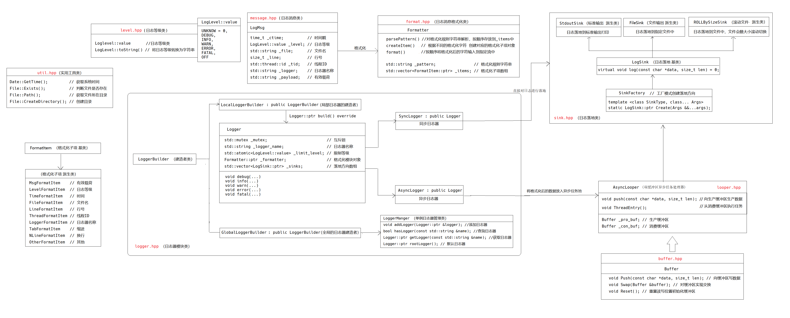

# Log_System 基于多设计模式下的同步&amp;异步日志系统

## 1. 项目介绍

本项目主要实现一个日志系统， 其主要支持以下功能：

- 支持多级别日志消息，并且日志的输出级别在运行时可调。
- 支持同步日志和异步日志
- 支持可靠写入日志到控制台、文件以及滚动文件中
- 支持多线程程序并发写日志到一个日志文件中
- 支持扩展不同的日志落地目标地

## 2. 开发环境

* CentOS 7
* vscode/vim
* g++/gdb
* Makefile

## 3. 核心技术

* 类层次设计(继承和多态的应用)
* C++11(多线程、auto、智能指针、右值引用等)
* 双缓冲区
* 生产消费模型
* 多线程
* 设计模式(单例、工厂、代理、模板等)

## 4. 为什么需要日志系统

1. 生产环境的产品为了保证其稳定性及安全性是不允许开发人员附加调试器去排查问题， 可以借助日志系统来打印一些日志帮助开发人员解决问题，上线客户端的产品出现bug无法复现并解决， 可以借助日志系统打印日志并上传到服务端帮助开发人员进行分析。
2. 对于一些高频操作（如定时器、心跳包）在少量调试次数下可能无法触发我们想要的行为，通过断点的暂停方式，我们不得不重复操作几十次、上百次甚至更多，导致排查问题效率是非常低下， 可以借助打印日志的方式查问题。
3. 在分布式、多线程/多进程代码中， 出现bug比较难以定位， 可以借助日志系统打印log帮助定位bug。

## 5. 日志系统框架设计

本项目实现的是一个多日志器日志系统，主要实现的功能是将一条消息，进行格式化成为指定格式的字符串后，写入到指定位置，并且支持同步与异步两种日志落地方式。

### 模块划分

* 日志等级模块：对输出日志的等级进行划分，以便于控制日志的输出，并提供等级枚举转字符串功能。
* 日志消息模块：中间存储日志输出所需的各项要素信息
* 日志消息格式化模块：设置日志输出格式，并提供对日志消息进行格式化功能。
* 日志消息落地模块：决定了日志的落地方向，可以是标准输出，也可以是日志文件，也可以滚动文件输出。
* 日志器模块：此模块是对以上几个模块的整合模块，用户通过日志器进行日志的输出，有效降低用户的使用难度。包含有：日志消息落地模块对象，日志消息格式化模块对象，日志输出等级
* 日志器管理模块：创建的所有日志器进行统一管理。并提供一个默认日志器提供标准输出的日志输出。
* 异步线程模块：实现对日志的异步输出功能，用户只需要将输出日志任务放入任务池，异步线程负责日志的落地输出功能，以此提供更加高效的非阻塞日志输出。

### 模块关系图

## 6. 性能测试

下面对日志系统做一个性能测试，测试一下平均每秒能打印多少条日志消息到文件。
主要的测试方法是：每秒能打印日志数 = 打印日志条数 / 总的打印日志消耗时间
主要测试要素：同步/异步 & 单线程/多线程

* 100w+条指定长度的日志输出所耗时间
* 每秒可以输出多少条日志
* 每秒可以输出多少MB日志
